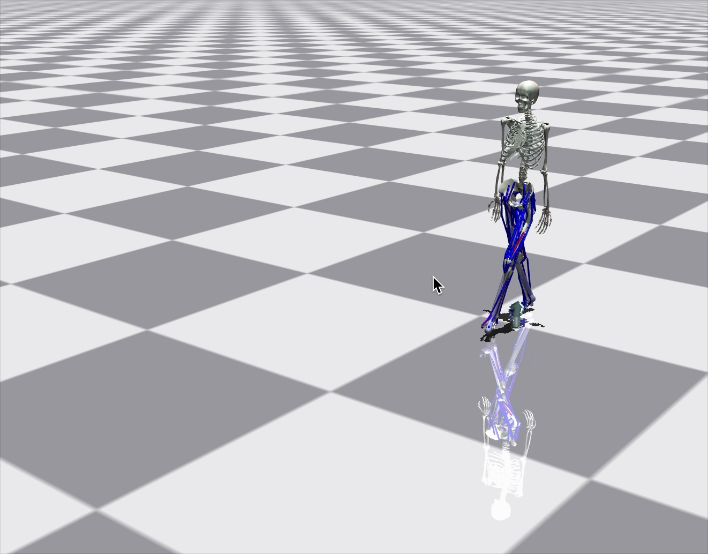

# MSK DRL Demo

This repository showcases simulation / model outputs: render snapshots, a muscle-state heatmap, and a state video.

## Model output

## Muscle state heatmap (right)

## Model state video

GitHub does not embed `.mov` / HTML `<video>` in README files, so the clip is not shown as a player on the repo page. Use the preview below (click to open or download the video) or the direct file link.

Direct link: [model_state.mov](./model_state.mov)

---

## Files in this repo

| File | Description |
|------|-------------|
| `model output.png` | Model visualization snapshot |
| `muscle_states_heatmap_right.png` | Right-side muscle state heatmap |
| `model_state.mov` | Screen recording / animation of model state |
| `model_state_preview.png` | Still frame from the video (shown in README; links to the `.mov`) |

After you push this folder to GitHub, PNG previews render in the README; use the clickable preview or the `.mov` link to watch the full clip.
